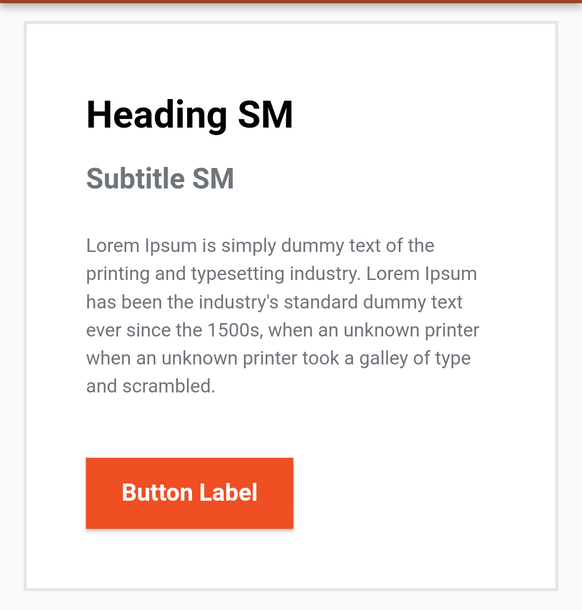
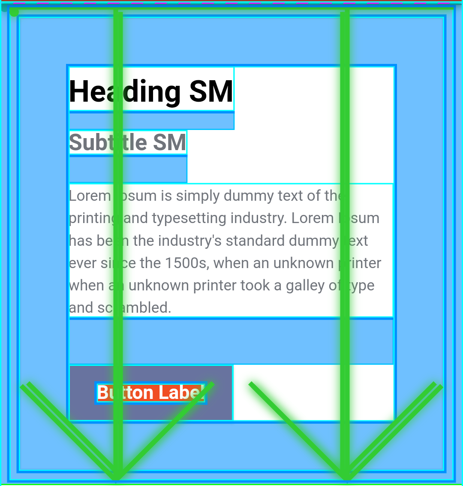
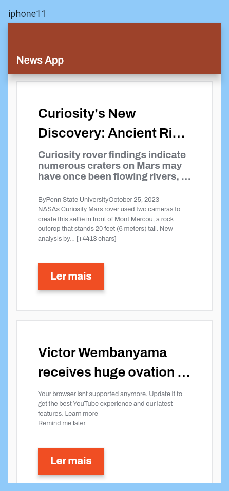
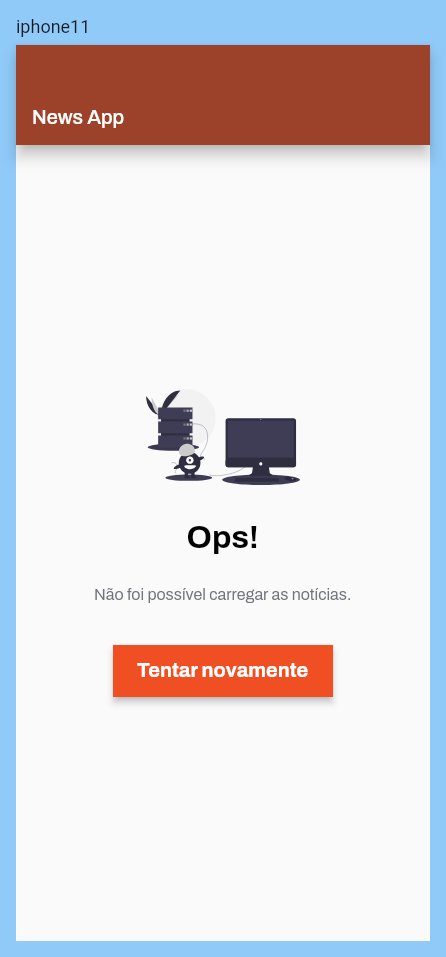

# Google News App

Repositório com o código-fonte da solução para o desafio técnico da [Meiuca](https://www.meiuca.co/en).

O aplicativo é um agregador de notícias que utiliza a [News API](https://newsapi.org/) para obter as notícias.

## Visão geral

O desafio consiste em desenvolver componentes utilizando a folha Design Tokens fornecida pela Meiuca. Após a criação dos componentes, desenvolver um aplicativo que os utiliza para exibir as notícias obtidas pela [News API](https://newsapi.org/).

Optei por gerar os tokens manualmente devido a algumas [limitações encontradas](#alguns-dos-problemas-encontrados-foram) ao utilizar [style-dictionary](https://amzn.github.io/style-dictionary/#/). Eles estão disponíveis no pacote [package/ds](packages/ds/lib/src).

Busquei manter a arquitetura o mais independente possível de bibliotecas externas, recorrendo a elas apenas quando absolutamente necessário. Além disso, adotei as melhores práticas de desenvolvimento de software, incluindo a implementação de testes automatizados e arquitetura baseada em Clean Architecture.

### Design Tokens

> A Folha de Design Tokens é um arquivo JSON que contém informações de cores, tipografia, espaçamento e outros valores utilizados para a criação dos componentes do Design System.

Atualmente, a Amazon mantém um projeto open-source chamado [style-dictionary](https://amzn.github.io/style-dictionary/#/) que permite a geração de código a partir de um arquivo de Design Tokens, simplificando seu uso para diversos frameworks e linguagens.

Realizei alguns testes utilizando o `style-dictionary` para gerar código para o Flutter, mas o suporte para ele ainda é limitado, o que inviabiliza a geração automática de código para os componentes de forma satisfatória.

#### Alguns dos problemas encontrados foram:

- Não transforma porcentagens em valores literais, como `$border-radius-*` e `$line-height-*`;
- Suporta apenas tipos primitivos e alguns do pacote `dart:ui`, não incluindo `EdgeInsets` e `BorderRadius`.
- Muitas colisões de tokens na categoria `size`;
- Impossibilidade de utilizar filtros para gerar tokens específicos em um mesmo arquivo, como seria o caso para os `$spacing-*` (issue https://github.com/amzn/style-dictionary/issues/965);
- Conversão de valores do tipo `size` de maneira confusa, cada pixel é multiplicado por 16.

Foi avaliada a possibilidade de utilizar uma biblioteca alternativa chamada [style-dictionary-figma-flutter](https://github.com/aloisdeniel/style-dictionary-figma-flutter), que utiliza internamente o `style-dictionary`, mas sua configuração é bem limitada, o que impossibilita a personalização da configuração. Criei um [fork](https://github.com/pedrox-hs/style-dictionary-figma-flutter) do projeto e realizei algumas alterações, mas ainda assim não obtive sucesso, pois isso demandaria muito mais tempo do que o disponível.

A biblioteca com a proposta inicial - e não concluída - para a geração de código está disponível em [packages/ds/generator](packages/ds/generator), a configuração [packages/ds/config.js](packages/ds/config.js) e o código gerado com o `style-dictionary` em [packages/ds/lib/src/style_dictionary](packages/ds/lib/src/style_dictionary). No entanto, como ficou incompleto, não foi utilizado para a criação dos componentes.

#### Solução

Todos os tokens foram escritos manualmente no projeto para o pacote [package/ds](packages/ds/lib/src), sendo necessário buscar cada um dos valores no [Figma](https://www.figma.com/file/zPB52VG5uHPB96L9RKJBu0/Processo-Seletivo-Meiuca-%7C-Flutter?node-id=1%3A1302&mode=dev) e transformá-los nos tipos utilizados no Dart/Flutter.

Organizei os tokens em arquivos separados, de acordo com o contexto do tipo e categoria, e disponibilizei-os como uma biblioteca no projeto.

### Componentes

#### CardContent

O componente `CardContent` é um componente que exibe o conteúdo de uma notícia. O componente é composto por um título, uma descrição, uma breve descrição e um botão para abrir a notícia no navegador.




### Telas

#### Tela de Listagem de Notícias

A tela de listagem de notícias é composta por uma lista de notícias, que são exibidas utilizando o componente `CardContent`.

<div style="display:inline-block;overflow: hidden;background-color:#8fc8f7;">
    
</div>

> Imagem gerada através dos golden tests.

#### Tela de Erro

A tela de erro é exibida quando ocorre um erro ao obter as notícias. A tela é composta por uma ilustração, uma mensagem de erro e um botão para tentar novamente. A ilustração foi obtida no site [undraw.co](https://undraw.co/).

<div style="display:inline-block;overflow: hidden;background-color:#8fc8f7;">
    
</div>

> Imagem gerada através dos golden tests.

### Arquitetura

O aplicativo foi desenvolvido utilizando a arquitetura baseada em [Clean Architecture](https://blog.cleancoder.com/uncle-bob/2012/08/13/the-clean-architecture.html), com a divisão em camadas de acordo com o diagrama abaixo:


#### Estrutura do Projeto

O projeto foi organizado em pacotes, visando a extração de arquivos por contexto, de modo a permitir a reutilização de componentes em diferentes partes da aplicação. A estrutura do projeto pode ser descrita da seguinte forma:

- `packages/core`: Este pacote contém abstrações e utilitários que geralmente são compartilhados por outros pacotes. Dentro dele, encontramos:
    - `packages/core/network`: Abstrações e utilitários relacionados à comunicação com a rede.
    - `packages/core/navigation`: Abstrações que facilitam a navegação entre telas.
- `packages/commons`: Aqui, estão disponíveis implementações, como funções, extensões e outros elementos que podem ser reutilizados. Este pacote se subdivide em:
    - `packages/commons/foundation`: Implementações comuns que podem ser utilizadas em diversos pacotes para criar funcionalidades.
    - `packages/commons/testing`: Este pacote contém código para simplificar a implementação de testes automatizados.
- `packages/ds`: Este pacote abriga os tokens do Design System.
- `packages/features`: Este pacote engloba o código relacionado às funcionalidades do aplicativo. Internamente, ele é organizado da seguinte forma:
    - `packages/features/news`: Subpacote dedicado à funcionalidade de notícias. Este subpacote está dividido em diretórios que seguem a estrutura da Clean Architecture:
        - `lib/src/domain`: Neste diretório, encontram-se as regras de negócio, entidades e abstrações.
        - `lib/src/data`: A camada de dados, incluindo a implementação de repositórios e fontes de dados.
        - `lib/src/presentation`: A camada de apresentação, que engloba a implementação das telas, view models, widgets e outros elementos visuais.
        - `test`: Este diretório é dedicado aos testes automatizados.

#### Camada de Apresentação

Optei por usar o conceitos do [BLoC Pattern](https://bloclibrary.dev/#/coreconcepts) na implementação da camada de apresentação. O BLoC Pattern é um padrão de gerenciamento de estado que utiliza Streams e Sink para a comunicação entre as camadas de apresentação e domínio.

Para a implementação do conceito `Cubit`, em vez de utilizar a biblioteca [bloc](https://pub.dev/packages/bloc), escolhi usar a classe [ChangeNotifier](https://docs.flutter.dev/data-and-backend/state-mgmt/simple#changenotifier), que já está incluída no SDK do Flutter. A classe `ChangeNotifier` é uma implementação do padrão [Observer](https://pt.wikipedia.org/wiki/Observer) que permite que os Widgets sejam notificados quando o estado do objeto muda.

Além disso, utilizei a classe [ChangeNotifierProvider](https://docs.flutter.dev/data-and-backend/state-mgmt/simple#changenotifierprovider) da biblioteca [provider](https://pub.dev/packages/provider) para aplicar o conceito de [Inversão de Controle](https://en.wikipedia.org/wiki/Inversion_of_control) e [Injeção de Dependências](https://en.wikipedia.org/wiki/Dependency_injection) na minha aplicação.

### Bibliotecas Utilizadas

- [equatable](https://pub.dev/packages/equatable): Utilizada para comparar objetos.
- [flutter_svg](https://pub.dev/packages/flutter_svg): Utilizada para renderização de imagens SVG, como a ilustração para o estado de erro.
- [freezed](https://pub.dev/packages/freezed): Utilizada para gerar classes imutáveis, facilitando a implementação do conceito de [Value Object](https://martinfowler.com/bliki/ValueObject.html).
- [http](https://pub.dev/packages/http): Utilizada para fazer requisições HTTP.
- [provider](https://pub.dev/packages/provider): Utilizada para injeção de dependências e inversão de controle.
- [url_launcher](https://pub.dev/packages/url_launcher): Utilizada para abrir URLs.


## Instalação a partir do código-fonte

### Requisitos

- [SDK Flutter](https://flutter.dev/docs/get-started/install) >=3.13.9
- Chave de API para a [News API](https://newsapi.org/)
- Opcional: [make](https://www.gnu.org/software/make/), para facilitar a execução de alguns comandos.
- Itens opcionais de acordo com a plataforma para a qual deseja compilar:
    - [Chrome](https://www.google.com/chrome), para compilar para a Web.
    - [SDK iOS](https://developer.apple.com/xcode/), para compilar para iOS ou macOS.
    - [SDK Android](https://developer.android.com/studio), para compilar para Android.
    - [JDK](https://www.oracle.com/java/technologies/javase-downloads.html), para compilar para Android.


### Configuração

Para a configuração, copie o arquivo `.env.example` para `.env` (ou utilize `make setup`, se preferir) e preencha a variável `NEWS_API_KEY` com a sua chave de API da [News API](https://newsapi.org/).

O conteúdo do arquivo `.env` deve ser assim:


```
NEWS_API_URL=https://newsapi.org/v2/
NEWS_API_KEY=<sua chave de API>
```

### Compilação e Execução

Para compilar o aplicativo, você pode executar os seguintes comandos:

```bash
# Web
flutter build web --dart-define-from-file=.env

# Android
flutter build apk --dart-define-from-file=.env

# iOS
flutter build ios --dart-define-from-file=.env

# macOS
flutter build macos --dart-define-from-file=.env

```

Para executar o aplicativo, você pode usar os seguintes comandos:

```bash
# Web
flutter run -d chrome --dart-define-from-file=.env
# ou
flutter run -d web-server --dart-define-from-file=.env

# Android/iOS/macOS
flutter run -d <device> --dart-define-from-file=.env
```

### Comandos Úteis

Se você tiver o `make` instalado, pode executar os comandos da seguinte forma: `make <target>`.

Execute `make help` para ver a lista de comandos disponíveis:

```
Uso: make [target]

target:
  help           Mostra todos os comandos disponíveis com uma breve descrição
  setup          Cria o arquivo .env e instala as dependências
  run            Executa o app Flutter com o arquivo .env; você pode adicionar argumentos adicionais como `make run args='-d chrome'`
  run-web        Executa o app Flutter Web com o arquivo .env
  test-all       Executa todos os testes
```

## Testes Automatizados

Pirâmide de testes:


> Imagem extraída do artigo [Por que e o que é possível testar?](https://www.alura.com.br/artigos/por-que-e-o-que-e-possivel-testar) da Alura.

### Testes Unitários

A maior quantidade de testes implementados foram os testes unitários, por serem mais rápidos de executar e menos custosos de manter.

Para os testes unitários foram utilizados mocks para simular o comportamento das dependências de cada unidade. Os mocks foram criados utilizando a biblioteca [mocktail](https://pub.dev/packages/mocktail).

### Testes de Integração e UI

Para os testes de UI foram utilizados os [golden tests](https://flutter.dev/docs/testing/ui#golden-tests), que são testes que comparam a renderização de um `Widget` com uma imagem de referência. Optei por realizar esses testes de forma integrada, somente fazendo mock da navegação e da camada de network, garantindo assim que todas as camadas estão funcionando corretamente.

### Execução dos Testes

Para executar todos os testes, execute o seguinte comando:

```bash
make test-all
```

Ou acesse a pasta de cada pacote individualmente e execute o comando `flutter test`. Os pacotes que possuem testes automatizados são:

- `packages/core/network`
- `packages/features/news`

### Bibliotecas Utilizadas para Testes

As principais bibliotecas utilizadas para a implementação dos testes são:

- [mocktail](https://pub.dev/packages/mocktail): Mocks;
- [test](https://pub.dev/packages/test): Testes unitários;
- [flutter_test](https://pub.dev/packages/flutter_test): Testes de Widgets;
- [golden_toolkit](https://pub.dev/packages/golden_toolkit): Golden tests;
- [alchemist](https://pub.dev/packages/alchemist): Facilita a criação de golden tests.


## Próximos Passos

Possíveis evoluções para o projeto:

- [ ] **Automatizar a Geração de Código a partir do Arquivo de Design Tokens:** Com tempo hábil e alinhamento com o time de design e outros desenvolvedores, seria possível automatizar a geração de código a partir do arquivo exportado pelo Figma, utilizando o `style-dictionary` em uma biblioteca própria para o Flutter;
- [ ] **Galeria do DS:** Criar uma galeria com todos os componentes do DS, para facilitar a visualização e testes dos componentes, que pode ser automatizada;
- [ ] **CI/CD:** Configurar o CI/CD para executar os testes, análise estática e gerar os artefatos de compilação para as plataformas suportadas, inclusive publicando-os em suas respectivas lojas e no GitHub Pages;
- [ ] **Mais Testes:** Implementar mais testes unitários, de integração e de UI, inclusive para os componentes e interações;
- [ ] **Firebase Crashlytics:** Configurar o Firebase Crashlytics para monitorar os erros e falhas do aplicativo.

<!--
Para eventuais consultas e dar transparência:
Link da conversa para a correção ortográfica feita pelo Chato Gepeto: https://chat.openai.com/share/bf0c5f88-cd42-4f85-8937-1968ae391d70
-->